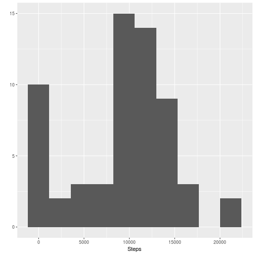
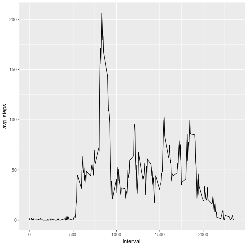
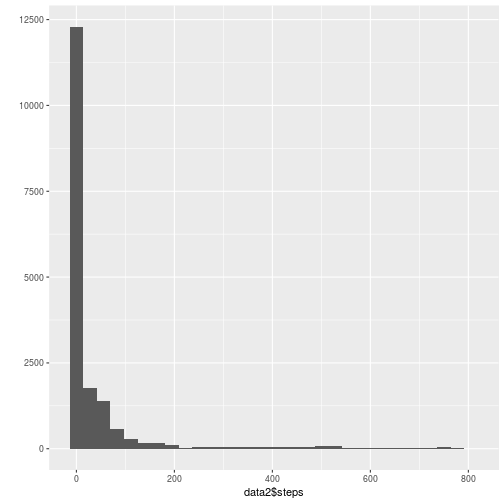
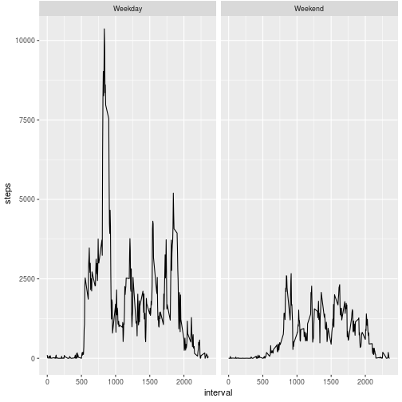

# Reproducible Research - Project 1


```r
# Load the data and libraries
library(dplyr)
library(ggplot2)
data <- read.csv('activity.csv')
```

```
## Warning in file(file, "rt"): cannot open file 'activity.csv': No such file
## or directory
```

```
## Error in file(file, "rt"): cannot open the connection
```

## What is the mean number of steps per day?


```r
# Total number of steps taken per day plotted as a histogram
steps_per_day <- data %>% group_by(date) %>% summarize(steps=sum(steps, na.rm=TRUE))
qplot(steps_per_day$steps, xlab='Steps', bins=10)
```



```r
summary(steps_per_day$steps)
```

```
##    Min. 1st Qu.  Median    Mean 3rd Qu.    Max. 
##       0    6778   10400    9354   12810   21190
```
## What is the average daily activity pattern?


```r
# Average number of steps per interval
interval_avg <- data %>% group_by(interval) %>% summarize(avg_steps=mean(steps, na.rm=TRUE))
ggplot(interval_avg, aes(x=interval, y=avg_steps)) + geom_line()
```



### Which 5 minute interval on average contains the maximum number of steps?


```r
interval_avg[which.max(interval_avg$avg_steps),]
```

```
## # A tibble: 1 x 2
##   interval avg_steps
##      <int>     <dbl>
## 1      835      206.
```

## Imputing Missing Values


```r
# Total number of missing values
sum(is.na(data$steps))
```

```
## [1] 2304
```

```r
# Impute using mean for the missing value
impute.NA <- function(i) {
    interval_avg[interval_avg$interval==i,2]
}

# Apply impute function to all missing steps values
data2 <- data
for (i in seq(1:length(data2$steps))) {
    ifelse(is.na(data2[i,1]), data2[i,1] <- impute.NA(data2[i,3]), 0)
}

sum(is.na(data2$steps))
```

```
## [1] 0
```

```r
# Histogram of steps taken each day
qplot(data2$steps, geom='histogram')
```

```
## `stat_bin()` using `bins = 30`. Pick better value with `binwidth`.
```



```r
# Mean and Median
summary(data2$steps)
```

```
##    Min. 1st Qu.  Median    Mean 3rd Qu.    Max. 
##    0.00    0.00    0.00   37.38   27.00  806.00
```

```r
# Mean and median have changed considerably after imputing missing values
```

## Are there any differences in activity patterns between weekdays and weekends?


```r
# Create weekday factor
data2$weekday <- as.factor(weekdays(as.POSIXlt(data$date)))
data2$weekend <- as.factor(ifelse(data2$weekday %in% c('Saturday','Sunday'), 'Weekend', 'Weekday'))

# Create panel plot
avg_steps <- data2 %>% group_by(interval, weekend) %>% summarize(steps=sum(steps, na.rm=TRUE))
ggplot(avg_steps, aes(x=interval, y=steps)) + geom_line() + facet_grid(cols=vars(weekend))
```


